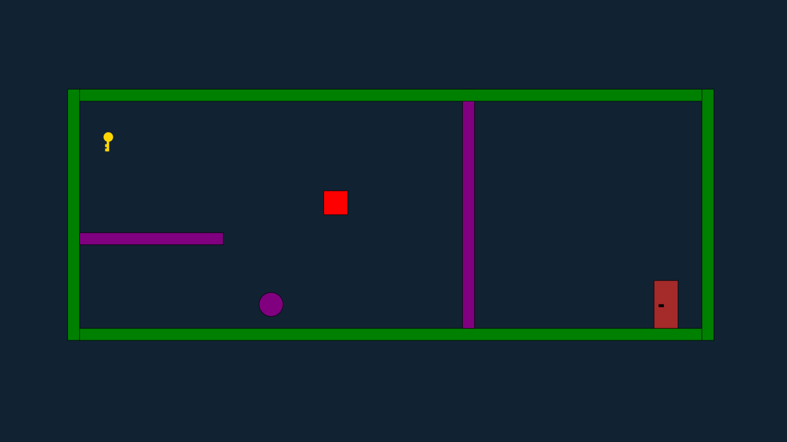

# [Color Cube](https://Ranxen.github.io)

Color Cube is a simple platformer game where the player has to reach the door to get to the next level. By collecting color orbs the player can switch their color to match the color of the platforms. Collision is only handled if player and platform have different colors, so the player can move through platforms if they have the same color. Before reaching the door the player has to collect a key to unlock it.

## Touch Controls

The player can be controlled by touching the on screen buttons. The player can move left and right and jump. To switch colors the player can either tap a color on the color wheel or rotate the selector to the desired color.

## Alternatively - Keyboard Controls

| Key | Action |
| --- | --- |
| `A` | Move left |
| `D` | Move right |
| `Q` or `Arrow Left` | Switch color left |
| `E` or `Arrow Right` | Switch color right |
| `R` | Restart level |
| `Space` | Jump |